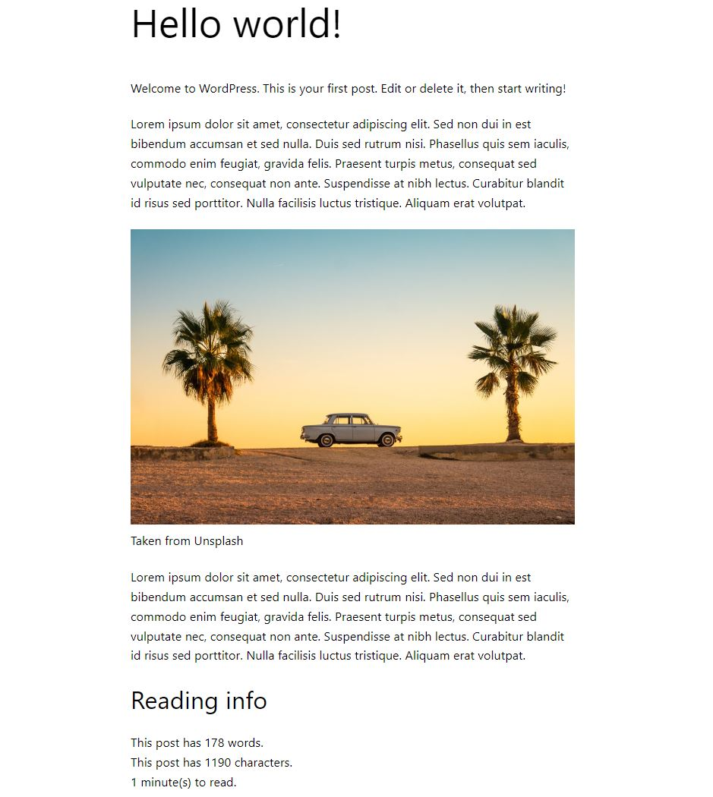
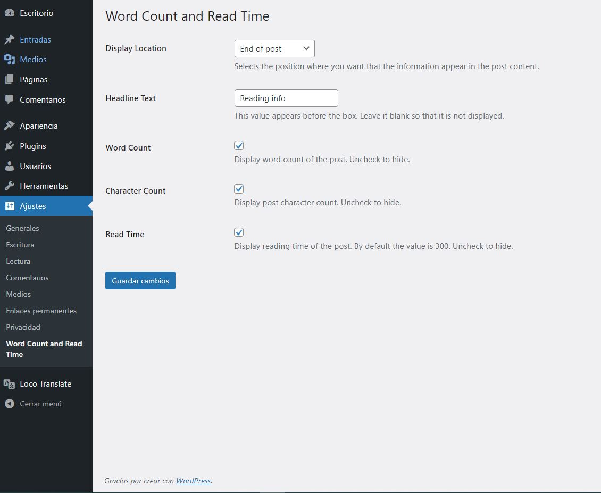

# Post Word Count and Read Time

Show users the reading time, number of words and number of characters contained in each post on your website.

This plugin has only been tested with Wordpress 6.1.1 version.

### Previews

## How it works

* Select the position where you want to display the information. Above or below the post content.

* Add a title (optional)

* Check the elements you want to show to your readers. Number of words, characters and/or reading time.

* If you do not want to display an element simply leave it empty or do not check it.

## Translations

The plugin contains the parameters to translate it to any language using a plugin. I recommend the plugin loco-translate.

## License

WordPress is free software, and is released under the terms of the GNU General Public License version 2 or (at your option) any later version. 
